# Deployed Addresses

Deployed contracts' addresses for all supported networks can be found [here](./projects/hardhat-deploy/networks/)
# Smart contracts for Rarible Protocol

Consists of:

* Exchange v2: responsible for sales, auctions etc.
  * security audit was done by ChainSecurity: https://chainsecurity.com/security-audit/rarible-exchange-v2-smart-contracts/
* Tokens: for storing information about NFTs
* Specifications for on-chain royalties supported by Rarible

See more information about Rarible Protocol at [docs.rarible.org](https://docs.rarible.org).

Also, you can find Rarible Smart Contracts deployed instances across Mainnet, Testnet and Development at [Contract Addresses](https://docs.rarible.org/reference/contract-addresses/) page.

## Compile, Test, Deploy

```shell
yarn
yarn bootstrap
```
if error, check node version for `yarn` expected node version ">=14.18.2", for check and set necessary version use, for example
```shell
node -v
nvm use 18.13.0
```
then use truffle to compile, test: cd into directory and then
```shell
truffle test --compile-all
```

## Protocol overview

Rarible protocol is a combination of smart-contracts for exchanging tokens, tokens themselves, APIs for order creation, discovery, standards used in smart contracts.

The Protocol is primarily targeted to NFTs, but it's not limited to NFTs only. Any asset on EVM blockchain can be traded on Rarible.

Smart contracts are constructed in the way to be upgradeable, orders have versioning information, so new fields can be added if needed in the future.

## Trade process overview

Users should do these steps to successfully trade on Rarible:

* Approve transfers for their assets to Exchange contracts (e.g.: call approveForAll for ERC-721, approve for ERC-20) — amount of money needed for trade is price + fee on top of that. Learn more at exchange contracts [README](https://github.com/rarible/protocol-contracts/tree/master/exchange-v2).
* Sign trading order via preferred wallet (order is like a statement "I would like to sell my precious crypto kitty for 10 ETH").
* Save this order and signature to the database using Rarible protocol API (in the future, storing orders on-chain will be supported too).

If the user wants to cancel the order, he must call cancel function of the Exchange smart contract.

Users who want to purchase something on Rarible should do the following:

* Find an asset they like with an open order.
* Approve transfers the same way (if not buying using Ether).
* Form order in the other direction (statement like "I would like to buy precious crypto kitty for 10 ETH").
* Call Exchange.matchOrders with two orders and first order signature. 

## Suggestions

You are welcome to [suggest features](https://github.com/rarible/protocol/discussions) and [report bugs found](https://github.com/rarible/protocol/issues)!

## Contributing

The codebase is maintained using the "contributor workflow" where everyone without exception contributes patch proposals using "pull requests" (PRs). This facilitates social contribution, easy testing, and peer review.

See more information on [CONTRIBUTING.md](https://github.com/rarible/protocol/blob/main/CONTRIBUTING.md).

---

## Branches

- **`main`**  
  This is the default branch where the latest development happens once releases are completed and merged back in.

- **`release/*`**  
  Used for stabilizing and releasing code. A new `release/x` branch is created from `main` when the team is ready to prepare a new release.

- **`feature/PT-xxx`**  
  Short-lived feature branches for implementing new features or bug fixes. Merged into a `release/*` branch when preparing a release.

---

## Workflow

1. **Create a Release Branch**  
   - When ready to release, create a new `release/*` branch from `master`.

2. **Merge Feature Branches**  
   - Merge all relevant `feature/PT-xxx` branches into the new `release/*` branch.

3. **Tag & Deploy (Beta)**  
   - In the `release/*` branch, create a beta tag using the format `v{major}.{minor}.{patch}-beta.{number}`.  
   - Deploy npm packages by running:
     ```bash
     npx lerna version v{major}.{minor}.{patch}-beta.{number} --yes
     ```

4. **Test on Testnet**  
   - Deploy from the `release/*` branch to the testnet for validation and QA.

5. **Deploy to Mainnet**  
   - Once testing is complete and everything looks good, deploy the same `release/*` branch to mainnet.

6. **Merge Back to `master`**  
   - After a successful release, merge the `release/*` branch back into `master`.

---

## Versioning

- The versions of **Cargo packages** and **npm** packages are synced.
- If you need to fix only the npm package, you can simply bump the **patch** version (e.g., from `v1.2.3-beta.1` to `v1.2.4-beta.1`).

---

## Diagram

```mermaid
flowchart LR
    A["feature/PT-xxx"] --> B["release/*"]
    B --> C["Create Release Branch from master"]
    C --> D["Tag: v&#123;major&#125;.&#123;minor&#125;.&#123;patch&#125;-beta.&#123;number&#125;"]
    D --> E["Deploy to Testnet"]
    E --> F["Test & Validate"]
    F --> G["Deploy to Mainnet"]
    G --> H["Merge release/* back to master"]
```



## How to check the release status

Go to the [Rarible Jenkins Protocol Contracts](http://jenkins.rarible.int/job/protocol-contracts) and check the release status.

## License

Smart contracts for Rarible protocol are available under the [MIT License](LICENSE.md).

