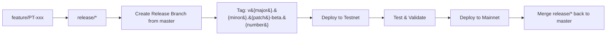

# Deployed Addresses

Deployed contracts' addresses for all supported networks can be found [here](./projects/hardhat-deploy/networks/)

# Smart contracts for Rarible Protocol

Consists of:

* Exchange v2: responsible for sales, auctions etc.
  * security audit was done by ChainSecurity: https://chainsecurity.com/security-audit/rarible-exchange-v2-smart-contracts/
* Tokens: for storing information about NFTs
* Specifications for on-chain royalties supported by Rarible

See more information about Rarible Protocol at [docs.rarible.org](https://docs.rarible.org).

Also, you can find Rarible Smart Contracts deployed instances across Mainnet, Testnet and Development at [Contract Addresses](https://docs.rarible.org/reference/contract-addresses/) page.

## Quick Start

```shell
nvm use      # uses .nvmrc (v20.18.3)
yarn         # install + link all workspaces
yarn build   # REQUIRED - see below
```

**Node version:** use the version in `.nvmrc` (v20.18.3). Newer versions (22/24) break the
toolchain (hardhat 2.x, lerna 8, patch-package) during install.

**`yarn bootstrap` no longer works** and is not needed. Lerna removed the `bootstrap` command
in v7; the root `package.json` script still references it and will fail. This repo uses yarn
workspaces, which already link every cross-package dependency during `yarn install`.

**`yarn build` is required before any deploy.** `projects/hardhat-deploy/hardhat.config.ts`
imports `./tasks`, and those tasks import generated typechain types from `@rarible/exchange-v2`.
Without the build, *every* hardhat command fails with `MODULE_NOT_FOUND` before it can even
read a network config.

`yarn build` currently fails at the end with `truffle: command not found` - several build
scripts invoke `truffle`, but it is not declared as a dependency anywhere. This only affects
truffle artifact generation; the typechain types needed for deployment are produced before
that step. To build just what a deploy needs:

```shell
yarn build:exchange-v2
```

## Deployment

The Rarible Protocol consists of multiple projects that need to be deployed in sequence. Use the following commands for different deployment scenarios.

### Full Deployment (All Projects)

Deploy all projects in the correct order:
```shell
yarn deploy
```

This command deploys:
1. `@rarible/deploy-proxy` - Proxy contracts and factories
2. `@rarible/drops` - Token contracts (ERC721, ERC1155)
3. `@rarible/hardhat-deploy` - Core protocol contracts (Exchange, Royalties, etc.)

### Individual Project Deployment

#### Deploy Proxy Contracts
```shell
yarn workspace @rarible/deploy-proxy run deploy
# Or with specific network and tags:
cd projects/deploy-proxy && npx hardhat deploy --tags ImmutableCreate2Factory --network <network_name>
```

#### Deploy Token Contracts
```shell
yarn workspace @rarible/drops run deploy
# Or with specific network:
cd projects/drops && npx hardhat deploy --network <network_name> --tags all
```

#### Deploy Core Protocol Contracts
```shell
yarn workspace @rarible/hardhat-deploy run deploy
# Or with specific network:
cd projects/hardhat-deploy && npx hardhat deploy --network <network_name> --tags all
```

### Network-Specific Deployment Examples

#### Deploy to Ethereum Mainnet
```shell
# Deploy all projects to mainnet
NETWORK=mainnet yarn deploy

# Deploy individual projects to mainnet
yarn workspace @rarible/deploy-proxy run deploy --network mainnet
yarn workspace @rarible/drops run deploy --network mainnet
yarn workspace @rarible/hardhat-deploy run deploy --network mainnet
```

#### Deploy to Polygon
```shell
# Deploy all projects to Polygon
NETWORK=polygon_mainnet yarn deploy

# Deploy individual projects to Polygon
yarn workspace @rarible/deploy-proxy run deploy --network polygon_mainnet
yarn workspace @rarible/drops run deploy --network polygon_mainnet
yarn workspace @rarible/hardhat-deploy run deploy --network polygon_mainnet
```


### ZK-Sync Deployment

For ZK-Sync compatible chains, use the special ZK deployment commands:

```shell
# Deploy to Abstract (ZK-Sync)
cd projects/drops && npx hardhat deploy --tags all-zk --network abstract --config zk.hardhat.config.ts

# Deploy to ZK-Sync Era
cd projects/hardhat-deploy && npx hardhat deploy --tags all-zk --network zksync --config zk.hardhat.config.ts
```

### Contract Verification

After deployment, verify contracts on block explorers:

#### Etherscan-compatible chains
```shell
cd projects/hardhat-deploy && npx hardhat --network <network_name> etherscan-verify
cd projects/drops && npx hardhat --network <network_name> etherscan-verify
```

#### Sourcify-compatible chains
```shell
cd projects/hardhat-deploy && npx hardhat --network <network_name> sourcify
cd projects/drops && npx hardhat --network <network_name> sourcify
```

### Network configuration

Networks are **not** defined in this repo and are **not** read from `.env`. Every hardhat config
calls `loadNetworkConfigs()` (`projects/deploy-utils/src/utils.ts`), which reads every `*.json`
file in `$NETWORK_CONFIG_PATH` (default: `~/.ethereum/`). **The filename is the hardhat network
name** - `~/.ethereum/my_chain.json` becomes `--network my_chain`.

Setting `PRIVATE_KEY` in `.env` has no effect on deployments; the deployer key is the `key`
field below. Likewise the verification API key comes from `verify.apiKey`, not `ETHERSCAN_API_KEY`.

```jsonc
{
  "url":        "https://rpc.example.io",
  "network_id": "12345",          // string; becomes hardhat chainId
  "chainId":    12345,            // number; required for explorer verification
  "address":    "0xDeployer...",
  "key":        "0xPRIVATE_KEY",  // MUST be 0x-prefixed or hardhat rejects it
                                  // omit `key` entirely to use Frame instead
  "gas":        12000000,         // per-tx gas limit; the 5000000 default is too low
                                  // for ExchangeV2 on some chains
  "gasPrice":   "auto",
  "timeout":    120000,
  "factory":    "0x...",          // optional; ImmutableCreate2Factory address.
                                  // enables deterministic addresses across chains
  "verify": {
    "apiKey":      "xyz",         // use a real key; "xyz" hits strict rate limits
    "apiUrl":      "https://explorer.example.io/api",
    "explorerUrl": "https://explorer.example.io"
  }
}
```

`chainId`, `verify.apiUrl` and `verify.explorerUrl` must **all** be present or the chain is
silently dropped from the explorer-verification config.

Keep the file readable only by you: `chmod 600 ~/.ethereum/<network>.json`.

### Environment variables

| Variable | Required | Default | Notes |
|---|---|---|---|
| `GAS_PRICE` | **Yes, in practice** | `1000000` (0.001 gwei) | Passed explicitly by every deploy script. The default is far below most chains' base fee and all transactions will be rejected. Set it in wei. |
| `TREASURY_ADDRESS` | **Yes, for `drops`** | none | Required by `drops` script `1006`; passed to `WLCollectionListing.initialize()`. Unset it and the deploy aborts with `invalid address or ENS name`. |
| `NETWORK_CONFIG_PATH` | No | `~/.ethereum` | Directory holding the network JSON files. |
| `DETERMENISTIC_DEPLOYMENT_SALT` | No | `0x1118` | Changing it changes every deterministic address. |
| `ROYALTIES_REGISTRY_TYPE` | No | `RoyaltiesRegistry` | Set to `RoyaltiesRegistryPermissioned` for the permissioned variant. |
| `HARDWARE_DERIVATION` + `DEPLOYER_ADDRESS` | No | none | Set both to sign with a Ledger instead of a private key. |

### Deploying to a new chain

1. Create `~/.ethereum/<network>.json` (above) and
   `projects/hardhat-deploy/utils/config/<network>.json`:
   ```json
   { "deploy_meta": false, "deploy_non_meta": true, "fee_receiver": "0x..." }
   ```
   `getConfig()` throws if this second file is missing.

2. Fund the deployer. **The deployer must be at nonce 0**: `deploy-proxy` script
   `00-deploy-immutable-create2-factory.ts` hardcodes `nonce: 0`, so the factory deployment
   must be that address's very first transaction on the chain. Send anything else first and
   the factory lands at a non-canonical address, diverging every deterministic address from
   your other chains.

3. Deploy the factory, then record its address as `factory` in the network JSON:
   ```shell
   cd projects/deploy-proxy
   npx hardhat deploy --tags ImmutableCreate2Factory --network <network>
   ```

4. If the chain has no Seaport/WETH deployment, add the network to `func.skip` in
   `projects/hardhat-deploy/deploy/905_deploy_exchangeWrapper.ts`, otherwise add a `settings`
   entry with its marketplace and WETH addresses.

5. Deploy core, then drops:
   ```shell
   export GAS_PRICE=<chain base fee in wei, with headroom>
   export TREASURY_ADDRESS=0x...
   cd projects/hardhat-deploy && npx hardhat deploy --tags all --network <network>
   cd ../drops              && npx hardhat deploy --tags all --network <network>
   ```

6. Verify, then regenerate the address table (requires `jq`):
   ```shell
   cd projects/hardhat-deploy
   npx hardhat --network <network> etherscan-verify
   NETWORK=<network> ./export-address-to-readme.bash
   ```

7. Commit `deployments/<network>/` and `networks/<network>.md`.

**On mainnet, transfer ownership afterwards.** A fresh deploy leaves the ProxyAdmin and
contract ownership with the deployer EOA - see the `transfer-ownership` task and `owners.md`.

#### Recovering an interrupted deploy

`hardhat-deploy` writes `<Name>_Implementation.json` and `<Name>_Proxy.json` before the
combined `<Name>.json`. If a run dies in between, the next run sees no `<Name>.json`, assumes
the proxy still needs initializing, and re-sends `upgradeAndCall` - which reverts with
`Initializable: contract is already initialized` even though the contract deployed fine.
Confirm the on-chain state (implementation slot, `owner()`), then either reconstruct the
combined artifact or redeploy that contract with `--reset`.

## Testing

To run tests before deployment:

```shell
# Test all projects
yarn test

# Test individual projects
cd projects/hardhat-deploy && npx hardhat test
cd projects/drops && npx hardhat test
```

## Protocol overview

Rarible protocol is a combination of smart-contracts for exchanging tokens, tokens themselves, APIs for order creation, discovery, standards used in smart contracts.

The Protocol is primarily targeted to NFTs, but it's not limited to NFTs only. Any asset on EVM blockchain can be traded on Rarible.

Smart contracts are constructed in the way to be upgradeable, orders have versioning information, so new fields can be added if needed in the future.

## Trade process overview

Users should do these steps to successfully trade on Rarible:

* Approve transfers for their assets to Exchange contracts (e.g.: call approveForAll for ERC-721, approve for ERC-20) — amount of money needed for trade is price + fee on top of that. Learn more at exchange contracts [README](https://github.com/rarible/protocol-contracts/tree/master/exchange-v2).
* Sign trading order via preferred wallet (order is like a statement "I would like to sell my precious crypto kitty for 10 ETH").
* Save this order and signature to the database using Rarible protocol API (in the future, storing orders on-chain will be supported too).

If the user wants to cancel the order, he must call cancel function of the Exchange smart contract.

Users who want to purchase something on Rarible should do the following:

* Find an asset they like with an open order.
* Approve transfers the same way (if not buying using Ether).
* Form order in the other direction (statement like "I would like to buy precious crypto kitty for 10 ETH").
* Call Exchange.matchOrders with two orders and first order signature. 

## Suggestions

You are welcome to [suggest features](https://github.com/rarible/protocol/discussions) and [report bugs found](https://github.com/rarible/protocol/issues)!

## Contributing

The codebase is maintained using the "contributor workflow" where everyone without exception contributes patch proposals using "pull requests" (PRs). This facilitates social contribution, easy testing, and peer review.

See more information on [CONTRIBUTING.md](https://github.com/rarible/protocol/blob/main/CONTRIBUTING.md).

---

## Branches

- **`main`**  
  This is the default branch where the latest development happens once releases are completed and merged back in.

- **`release/*`**  
  Used for stabilizing and releasing code. A new `release/x` branch is created from `main` when the team is ready to prepare a new release.

- **`feature/PT-xxx`**  
  Short-lived feature branches for implementing new features or bug fixes. Merged into a `release/*` branch when preparing a release.

---

## Workflow

1. **Create a Release Branch**  
   - When ready to release, create a new `release/*` branch from `master`.

2. **Merge Feature Branches**  
   - Merge all relevant `feature/PT-xxx` branches into the new `release/*` branch.

3. **Tag & Deploy (Beta)**  
   - In the `release/*` branch, create a beta tag using the format `v{major}.{minor}.{patch}-beta.{number}`.  
   - Deploy npm packages by running:
     ```bash
     npx lerna version v{major}.{minor}.{patch}-beta.{number} --yes
     ```

4. **Test on Testnet**  
   - Deploy from the `release/*` branch to the testnet for validation and QA.

5. **Deploy to Mainnet**  
   - Once testing is complete and everything looks good, deploy the same `release/*` branch to mainnet.

6. **Merge Back to `master`**  
   - After a successful release, merge the `release/*` branch back into `master`.

---

## Versioning

- The versions of **Cargo packages** and **npm** packages are synced.
- If you need to fix only the npm package, you can simply bump the **patch** version (e.g., from `v1.2.3-beta.1` to `v1.2.4-beta.1`).

---

## Diagram


```mermaid
flowchart LR
    A["feature/PT-xxx"] --> B["release/*"]
    B --> C["Create Release Branch from master"]
    C --> D["Tag: v&#123;major&#125;.&#123;minor&#125;.&#123;patch&#125;-beta.&#123;number&#125;"]
    D --> E["Deploy to Testnet"]
    E --> F["Test & Validate"]
    F --> G["Deploy to Mainnet"]
    G --> H["Merge release/* back to master"]
```

## How to check the release status

Go to the [Rarible Jenkins Protocol Contracts](http://jenkins.rarible.int/job/protocol-contracts) and check the release status.

## License

Smart contracts for Rarible protocol are available under the [MIT License](LICENSE.md).

