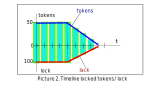
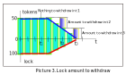
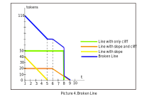
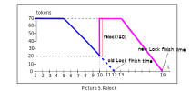
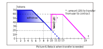
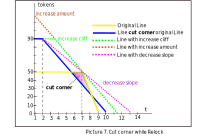

## Locking

This contract locks ERC-20 tokens and issues back locked tokens. These locked tokens are not transferrable, but they can be delegated to other users. Tokens unlock linearly. 

User locks tokens on `start` moment, amount of locked tokens is `bias`. In `cliff` period amount of locked tokens doesn't change, then it starts to decline linearly. 

Lock balance behaves pretty much the same way, but initial `bias` is multiplied by `value k` calculated using `Lock` parameters (slope, cliff, bias etc.)

This contract is based on [LibBrokenLine](./contracts/libs/LibBrokenLine.md).

### Features

### Functions supported for every user:
 - **lock** - create new `Lock`. Initial bias of the `Lock` depends on locked token amount and other parameters of the `Lock` (cliff, period etc.)
 - **relock** - change parameters of the `Lock`. It's possible to extend period and increase locked amount
 - **withdraw** - withdraw unlocked ERC-20 tokens (if something is unlocked already)
 - **delegateTo** - delegates specific `Lock` to other user
 - **migrate** - this function can be called only in `Migration` state. Will migrate user's `Locks` to new contract 

### Functions to read the data
 - **totalSupply**() - calculates sum of all locked balances
 - **balanceOf**(address account) - calculates current power for specified user (sums all his Locks and all delegated Locks)
 - **getAvailableForWithdraw**() - calculates token amount available to withdraw for user account
 - **locked**() - calculates locked token amount for user account
 - **getAccountAndDelegate**(uint id) - return address account and address delegate stored in contract by `Lock` id
 - **getWeek**() - calculates value of current week
 
### Functions for owner only
 - **stop**() - enter stopped state of the contract. Users can only withdraw tokens in this state. `Locks` can not be created/modified.
 - **startMigration(address to)** - enter migration state of the contract. Owner specifies address of the new locking contract (it should implement specific interface). In this state users can migrate their `Locks` to this new contract

#### Creating Lock

**lock** (address account, address delegate, uint amount, uint slope, uint cliff)

`Lock` can be of 3 types:
- only cliff,
- cliff plus slope,
- only slope.

For example, consider picture 1.

When creating the `Lock`, amount of `Lock` will be calculated using a special formula, but the function describing lock
balance will be almost the same as the function of locked tokens (it will be only multiplied by specific value) 

User can withdraw unlocked amount of tokens anytime, as shown in picture 3.

User can create unlimited number of `Locks`.
Each Lock created has a unique *id*.
Total lock of the user is calculated as sum of all locks delegated to him, consider picure 4.

#### Relock

**relock** (uint id, address newDelegate, uint newAmount, uint newSlope, uint newCliff) can be used to update parameters of the `Lock`.
Users are allowed to increase period and increase amount of tokens, example is shown in picture 5.

If there is not enough tokens locked for relock, then Locking contract will transfer needed amount of tokens from user account, as shown in picture 6.

Relock will throw if new `Lock` "cuts the corder" of the old `Lock`. In any period of time amount of locked ERC20 tokens should not be less than in original `Lock` (picture 7).   

#### Delegation

Users can delegate their lock to other accounts. This can be done when creating (lock), updating (relock). 
Also, special function delegate can be used to delegate one Lock to other account without changing `Lock` parameters.

#### Lock value calculation

Lock value is calculated by the formula:

lock = (tokens * (10000000 + 80400000 * (cliffPeriod - minCliffPeriod))/(104 - minCliffPeriod) + 40000000 * (slopePeriod - minSlopePeriod))/(104 - minSlopePeriod)) / 10^8;

 - `cliffPeriod` - time (number of weeks) when cliff works;
 - `minCliffPeriod` - minimal time (number of weeks) for cliff;
 - `slopePeriod` - time (number of weeks) when slope works;
 - `minSlopePeriod` - minimal time (number of weeks) for slope;

Lock value depends on the values of period cliff and period slope. The longer the lock period, the more lock
the user will receive. Max locking period equal 2 years cliff period and 2 years slope period.
The example linearly changes lock value, with token value = 1000, shown in the picture 8. 

##### Contract events
Locking contract emits these events:
- LockCreate - when Lock is created
- Relock - when Lock parameters change
- Delegate - when Lock is delegated to other account
- Withdraw - when user withdraws tokens
- Migrate - when user migrates his locks to new contract
- StopLocking - when user deprecate to run contract functions accept withdraw
- StartMigration - when user set address migrate to
- SetMinCliffPeriod - when contract owner set minimal cliff period
- SetMinSlopePeriod - when contract owner set minimal slope period