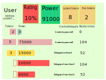

## Staking example use for front

This documentation presents how to use API contract to make DIAPP.
Example DIAPP:

###Rating
Use methods:
- **totalSupply**() - return power all staked tokens
- **balanceOf**(address account) - returns user power
For calculate rating = balanceOf / totalSupply * 100%

###Power
Method:
- **balanceOf**(address account) - returns user power
Method returns user power, use result

###Locked tokens
Method:
- **locked**() - calculates staked token amount for user account
- **getAvailableForWithdraw**() - calculates token amount available to withdraw for user account
For calculate Locked tokens =  locked - getAvailableForWithdraw

###Free tokens
Method:
- **getAvailableForWithdraw**() - calculates token amount available to withdraw for user account
Method returns value of tokens, may use for withdraw o restake.
###Stake detail data
In global there is two types of `Stake` 
- `Stake` generated by user account further in the document : `StakeFrom`.
- `Stake` generated to user account further in the document : `StakeTo`.

For getting `StakeTo` combine all events `StakeCreate` with parameter (indexed) `delegate` (address indexed delegate = user account)
Events from listEvents `StakeFrom` and `StakeTo` consider uniq id `Stake`
Each `Stake` Entities consider all information that need and have fields:
- address account;
- address delegate;
- uint id;
- uint time;
- uint amount;
- uint slope;
- uint cliff.

####1.Find Entities from the list `StakeFrom` 
For getting `StakeFrom` collect all events `StakeCreate` with parameter (indexed) `account` (address indexed account = user account).
All
Combine all events `Restake` with indexes: `id`(uint indexed id == `StakeFrom.id`) and `account` (address indexed account = user account)
It is possible that List will have an amount events `Restake`. Among events `Restake` find the latest by parameter `time`.
So one uniq Entity successfully detected. If events `Restake` doesn't find save `id` in separate list `NoRestake`.

Check that Entity has a real delegate address:
Find event `Delegate` with indexes: `id` (uint indexed id == `StakeFrom.id`) and `account` (address indexed account = user account)
If (event exists and time > Entity.time) {
   Entity.delegate =  Delegate.delegate;
}

Find event `StakeCreate` with indexes: `id` (uint indexed id == `NoRestake.id`) and `account` (address indexed account = user account).
Go throw all list `NoRestake`. Result will be list of Entities
Update Entity delegate address by calling method `getAccountAndDelegate(uint id)`;
Entity.delegate =  getAccountAndDelegate.delegate;

####2.Find Entities from the list `StakeTo`
Combine all events `Restake` with indexes: `account` (address indexed delegate = user account)
It is possible that List will have an amount events `Restake`. Among events `Restake` find the latest by parameter `time`.
So amount Entity successfully detected. If doesn't find any events `Restake` no Entity detected.

Find events `StakeCreate` with indexes: `account` (address indexed delegate = user account)
Find events `Delegate` with indexes: `account` (address indexed delegate = user account)

There is four types of stake:
Stake already finished
Stake to yourself 
Stake to another account
Stake from another account

For get list of stake need to logEventsQuery
StakeCreate ()
Restake
Delegate
##### Contract events
Staking contract emits these events:
- StakeCreate - when Stake is created
- Restake - when Stake parameters change
- Delegate - when Stake is delegated to other account
- Withdraw - when user withdraws tokens
- Migrate - when user migrates his stakes to new contract
- StopStaking - when user deprecate to run contract functions accept withdraw
- StartMigration - when user set address migrate to