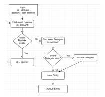

## Staking example use for front

This documentation presents how to use API contract to make DAPP.
Example DAPP:

###Rating
Use methods:
- **totalSupply**() - return power all staked tokens
- **balanceOf**(address account) - returns user power
For calculate rating = balanceOf / totalSupply * 100%

###Power
Method:
- **balanceOf**(address account) - returns user power
Method returns user power, use result

###Locked tokens
Method:
- **locked**() - calculates staked token amount for user account
- **getAvailableForWithdraw**() - calculates token amount available to withdraw for user account
For calculate Locked tokens =  locked - getAvailableForWithdraw

###Free tokens
Method:
- **getAvailableForWithdraw**() - calculates token amount available to withdraw for user account
Method returns value of tokens, may use for withdraw o restake.

###Stake detail data
In global there is two types of `Stake` 
- `Stake` generated by user account further in the document : `StakeFrom`.
- `Stake` generated to user account further in the document : `StakeTo`.

Each `Stake` Entities consider all information that need and have fields:
- address account;
- address delegate;
- uint id;
- uint time;
- uint amount;
- uint slope;
- uint cliff.

####1.Find Entities from the list `StakeFrom` 
For getting `StakeFrom` collect all events `StakeCreate` with parameter (indexed) `account` (address indexed account = user account).
From events `StakeCreate` get `id`. This `id` is `Stake` id which create by `account`.
`Stake` parameters can be changed by `restake` method, need to check all `id` for run `restake`.

Find `Restake` event with indexes: `id`(uint indexed id == `StakeFrom.id`) and `account` (address indexed account = user account)
If no any`Restake` event exists, no any `Stake` parameter change. Need to save Stake `Entity`.
Else `Restake` event consider field `account` - it is a new `id`. Repeat attempt to find `Restake` event with indexes: `id`,`account` till no any`Restake` event exists. 

Last check is to find  `Delegate` with indexes: `id`(uint indexed id == `StakeFrom.id`) and `account` (address indexed delegate = user account).
If find this event, need to update field `delegate`.

####2.Find Entities from the list `StakeTo`

