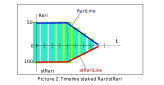

## Staking
#### Need to know before:
**bias** — amount of reserved Rari/stRari.

**slope** — the rate of bias decrease, amount of Rari/stRari by which bias will decrease per unit of time equal to one week.

**cliff** — period in weeks, when bias value constant.

**Lock** — stake object with a unique id that is defined by parameters **bias**, **slope**, **cliff**, **timeStart**.

**broken line** — the sum of all Locks, represented as a curve of the amount Rari/stRari over time.
### About
Staking contract - designed to reserve users **Rari** to the account of a smart contract.
Instead of **Rari**, the user is awarded **stRary** points, the sum of which determines 
the user's weight when voting for community decisions.

#### Creating Lock

The **Lock** life mechanism with the specified parameters (**bias**, **slope**, **cliff**) is visually displayed along the timeline 
as a **broken line**. The user decides what type of line to choose and which parameters to set. When creating a **Lock**,
**Rari** equal to the **bias** parameter transferred to the contract account. Depending on the parameters, **cliff** and **slope**
**Lock** can be of 3 types:
- only cliff,
- cliff plus slope,
- only slope.

For example, consider picture 1.

When creating the **Lock**, amount **stRary** will be calculated using a special formula, but the form
the line will be similar to the **Rary** line, consider picture 2. 

If the user uses line type with cliff only, then the mechanism no withdraw **Rary** provided until the end time of **Lock**.
When **slope** works, some amount of **Rary** can be withdraw back to the user, as shown in picture 3.

The user can create an unlimited number of **Lock**.
Each **Lock** created has a unique *id*. Moreover, with each creation
**Lock** increases the amount **Rari** and the amount **stRari**. Mechanism for changing Lock amount
for **Rari** and similar **stRari** is visually displayed using **broken line**, consider picure 4.

#### Modernize Lock

For each created **Lock**, user can execute the *restake* method, which allows you to overwrite the new **Lock** parameters.
The following parameters are available for changing: **bias**, **cliff**, **slope**, as shown in picture 5. It is important, 
that the **Lock** completion time during *restake* is not less than the initial **Lock** period, otherwise *restake* will fail. 

If the *withdraw* operation performed before the *restake*, or when the *restake* increases the bias 
to a high degree, then part of the missing **Rari** will be automatically transferred from the user to the contract, as shown in picture 6.

#### stRari calculate

Amount **stRari** is calculated by the formula:

stRari = k * Rari. 

K = (0.07 + 0.93 * (cliffPeriod / 104) ^ 2 + 0.5 * (0.07 + 0.93 * (slopePeriod / 104) ^ 2)).

Amount **stRari** depends on the values of period cliff and period slope. The longer the stake period, the more **stRari** 
the user will receive. Max staking period equal 2 years cliff period and 2 years slope period. 
The K coefficient changes non-linearly, as shown in the picture 7. 

#### stRari delegation

Delegation is the right of the user to designate the beneficiary of the staked amount of **Rari**. In other words, 
the user has the right to assign the address of another user or contract to whom the **stRari** will be listed.
The delegation only touches on **stRari**, not on the amount of **Rari**. Calling method withdraw() **Rari** always 
enumerates owner Lock, even if **stRari** is assigned to another user or contract.

The delegation mechanism is very flexible. Delegation can be done by calling *stake()*, the entire amount of **stRari** 
will be enumerated to another user. Delegation can be done by calling the *restake()* method, but this method aims 
to change the **Lock** parameters. If there is no need to change the **Lock** parameters, the authors of the staking contract
recommend using the *depute()* method. The method aims to translate **stRari** for Lock with the given id. A delegated
**Lock** with a given id can be redelegated an unlimited number of times. There is only one limitation, the delegation can
only be owner **Lock**.

### Description methods
##### Only owner contract methods
**stop**(); Set stop mode for contract. Stop mode means impossible to *stake()*, *reStake()*, *delegate()*
*withdraw()* enumerates all amount of Rari. When false - ordinary work.

**startMigration**(address *to*); Set addres new contract, allow migration.
- Input parameter: *to* - address new contract;

##### External methods
**__Staking_init**(IERC20Upgradeable *_token*); Initialize contract.
- Input parameter: *_token* - token for ERC20 transfer;

**stake**(address *account*, address *delegate*, uint *amount*, uint *slope*, uint *cliff*) returns (uint); Stake Lock, return id Lock
- Input parameter: *account* - address Lock owner;
- Input parameter: *delegate* - address stRari delegate;
- Input parameter: *amount* - amount Rari;
- Input parameter: *slope* - value slope;
- Input parameter: *cliff* - amount cliff;
- Output: idLock. if 0 - can`t stake.

**reStake**(uint *idLock*, address *newDelegate*, uint *newAmount*, uint *newSlope*, uint *newCliff*) returns (uint); Restake Lock with id, return new id Lock
- Input parameter: *idLock* - id Lock to restake;
- Input parameter: *newDelegate* - address stRari delegate;
- Input parameter: *newAmount* - amount Rari;
- Input parameter: *newSlope* - value slope;
- Input parameter: *newCliff* - amount cliff.
- Output: new idLock. if 0 - can`t reStake.

**withdraw**(); Withdraw available amount of Rari to User.

**depute**(uint *idLock*, address *newDelegate*); Delegate Lock with id to delegate.
- Input parameter: *idLock* - id Lock to restake;
- Input parameter: *newDelegate* - address stRari delegate;

**totalSupply**() returns (uint); Returns total amount stRari, staked on *staking* contract.
- Output: amount stRari. if 0 - can`t return amount stRari.

**balanceOf**(address *account*) returns (uint); Returns total amount stRari, staked on User with *account*.
- Output: amount stRari. if 0 - can`t return amount stRari.

**migrate**(uint[] memory *idLock*); Migrate Locks with id to a new contract.
- Input parameter: *idLock* - array contains id Locks to migrate.