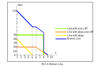

## Staking
#### Need to know before:
**bias** — amount of reserved Rari.

**cliff** — period in weeks, when bias value constant.

**slope** — amount of Rari by which bias will decrease per unit of time equal to one week, the rate of bias decrease.
### About
Staking contract - designed to reserve users **Rari** to the account of a smart contract.
Instead of **Rari**, the user is awarded **stRary** points, the sum of which determines 
the user's weight when voting for community decisions.

#### Creating Lock
Lock life mechanism with specified parameters (**bias**, **slope**, **cliff**) on a time scale clearly
displayed as a broken line. What type of line to choose and what parameters to set
the user decides. The user creates a Lock (Rari equal to the bias parameter
are transferred to the account of the contract) and selects the type of reservation picture 1.

When creating the Lock Amount, **stRary** will be calculated using a special formula, but the form
the line will be similar to the **Rary** line, picture 2. 

It is important that if the user uses line type with cliff only, then the mechanism
no **Rary** output is provided until the end time of Lock. When using slope **Rary**
can be listed back to the user as shown in picture 3.

The user can create an unlimited number of Lock.
Each Lock created has a unique id. Moreover, with each creation
Lock increases the amount **Rari** and the amount **stRari**. Mechanism for changing any amount
Lock for **Rari** and stRari is visually displayed using broken line picure 4.

